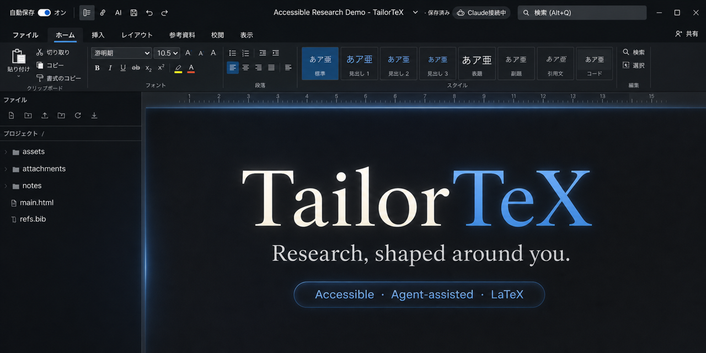

# TailorTeX

TailorTeX is a local-first, accessible visual workspace for writing real LaTeX documents. It is designed for researchers who need visual review, reliable TeX output, and close collaboration with human and AI research partners.

> For many researchers, LLMs improve efficiency. For a researcher who works from bed and operates an iPad with a single head switch, they can determine whether participation is possible at all.



> **Beta software.** TailorTeX is usable, but many parts are still rough, incomplete, or based on assumptions that need to be challenged through real use. Bug reports, accessibility experiences, issues, and pull requests are welcome—including changes to main functions.

## Why this project exists

TailorTeX was created by a researcher with a severe physical disability who works from bed and uses a single head-operated switch. Conventional research tools assume sustained typing, precise pointer control, and constant movement between editors, terminals, papers, notes, and submission systems. In this context, an LLM is not merely a way to complete the same work faster. It can mark the threshold between being able to participate in research and being excluded from it.

Delegation alone is not enough. A console is difficult to inspect, while full automation can remove the researcher from the judgments that make the research their own. TailorTeX provides a visual place to point an agent to a passage, let it operate the project, and then inspect the manuscript, evidence, notes, papers, and changes. The agent performs physical and syntactic work; the researcher retains intention, evaluation, and direction.

This does not cure an impairment or remove every existing barrier. It changes which abilities are sufficient for participation: articulating an intention, recognizing an error, evaluating evidence, and deciding what should happen next can become a complete path to producing research. TailorTeX keeps LaTeX as the publication format while making that human-agent collaboration visible and reviewable.

TailorTeX is based on the idea that accessibility begins with pursuing what is genuinely easiest for each person to use. Accessibility needs are not universal: they differ across disabilities, assistive technologies, bodies, environments, and research practices. TailorTeX is therefore a foundation rather than a claim to provide one final interface for everyone. Personal and community forks that reshape the experience around their users are expected and welcome.

At the same time, incompatible changes to the document model, collaboration protocol, project format, or agent interfaces make collaboration between researchers difficult. Main functions are not considered finished or beyond criticism; improvements are actively welcome. Please bring those changes upstream through an issue or pull request so they can be discussed, tested, and kept interoperable across forks. The exact boundary is defined in [Core Functions and Accessibility Adaptations](docs/CORE-AND-ADAPTATIONS.md).

Read the full [Design Philosophy](docs/DESIGN-PHILOSOPHY.md).

For installation and day-to-day research workflows, read the [User Guide](docs/USER-GUIDE.md). It covers project folders, writing, linked notes and papers, comments, AI collaboration, draft branches, frozen submissions, export, iPad access, and troubleshooting.

If you want to reshape the interface with a coding agent, follow [Customizing TailorTeX with Codex or Claude Code](docs/CUSTOMIZING-WITH-AGENTS.md). It includes prompt templates, safety checks, and guidance on when a change can remain in a personal fork or should become an upstream pull request.

## Core capabilities

- Ribbon-based visual editing with real LaTeX and PDF output
- Project folders, TeX and BibTeX editing, Markdown notes, and linked PDFs
- Draft branches for original, revision, and camera-ready versions
- Immutable submission archives with timestamps and SHA-256 manifests
- Comments, anchored discussion threads, and links back to document locations
- A scrollable research stream pairing literature notes with downloaded papers
- Local Codex and Claude Code integration through MCP and an iPad-accessible chat
- Streaming AI replies, persistent sessions, and `/model`, `/clear`, `/new`, `/status`, and `/help`
- Dark mode, keyboard navigation, screen-reader announcements, and accessibility checks
- Optional accessible PDF workflow with PDF/UA validation tools
- Local-first operation, with optional Firebase and Cloud Run deployment

## Quick start

Requirements:

- Node.js 20 or later
- A TeX distribution with `latexmk` and XeLaTeX or LuaLaTeX
- Git, recommended for draft/version features

On macOS, MacTeX is recommended. On Windows, TeX Live is recommended; MiKTeX can also work when on-demand package installation is enabled.

```bash
npm install
npm start
```

Open <http://localhost:3000>. To use another device on the same trusted LAN, open the Mac's LAN address on port 3000.

Optional accessible-PDF tools:

- veraPDF
- Python with PyMuPDF

## AI collaboration

The repository includes an MCP server and a local agent bridge. When TailorTeX starts, it can receive requests from the browser and route them to Codex or Claude Code on the Mac. Replies stream back to the browser.

Agents may edit files and run verification when requested. Before an agent task, TailorTeX backs up the project's main TeX, HTML, bibliography, and project metadata. Research notes belong in `notes/`, source materials in `attachments/`, and bibliography data in `refs.bib` unless the researcher explicitly chooses another layout.

Agent conversations, comments, and working links are system metadata. They are kept separate from publication-ready `main.tex` so research coordination does not leak into the submitted paper.

## Accessibility and forks

You are encouraged to fork TailorTeX and adapt it to your own access needs. Examples include changing contrast, density, reading order, interaction timing, pointer targets, keyboard behavior, speech feedback, or the balance between visual and textual presentation.

Changes local to an accessibility experience can remain in a fork. The following six areas are the project's main interoperable functions and should be changed through an upstream pull request:

- document fidelity and clean LaTeX publication output;
- interoperable project files, folders, links, import, and export;
- collaboration, comments, anchors, locks, and synchronization;
- draft versions and immutable submission evidence;
- MCP and browser-to-agent protocols;
- privacy, recovery, and data-integrity guarantees.

Visual presentation and interaction may be changed freely as long as these meanings remain compatible. See [Core Functions and Accessibility Adaptations](docs/CORE-AND-ADAPTATIONS.md) for the detailed boundary and [CONTRIBUTING.md](CONTRIBUTING.md) for the contribution workflow.

## Privacy and publication safety

Real papers, PDFs, notes, bibliographies, submissions, and agent inboxes must never be committed to this application repository. Runtime projects are stored under `projects/`, which is ignored by Git. Common research formats and private-data folders are also ignored as a second line of defense.

Run this before every public push:

```bash
npm run test:public
```

See [docs/PUBLICATION-SAFETY.md](docs/PUBLICATION-SAFETY.md) for the full release checklist. The initial audit found no paper files or project runtime data in the current Git history.

## Development

TailorTeX is a beta project. Reports about confusing behavior, inaccessible assumptions, data-loss risks, collaboration problems, and limitations in the main functions are particularly valuable. You may open an issue before you know the solution. Focused pull requests are also welcome.

```bash
npm run test:syntax
npm test
npm run test:public
```

The frontend uses vanilla JavaScript without a build step. The local server uses Node.js standard-library APIs. Optional cloud deployment instructions are in [cloud/DEPLOY.md](cloud/DEPLOY.md).

## Project status and license

This repository is being prepared for its first public beta release. TailorTeX is licensed under the [Apache License 2.0](LICENSE).
