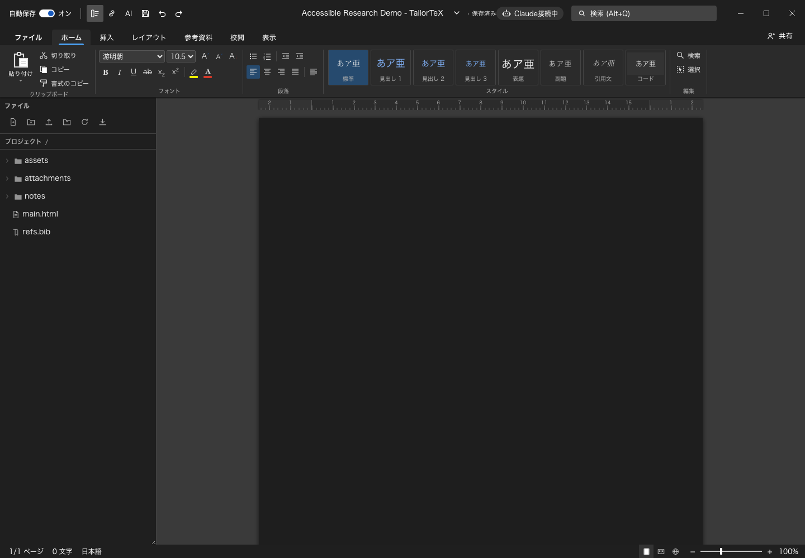

# TailorTeX User Guide

This guide covers the local research workflow: opening a project, writing, organizing sources, reviewing with an AI partner, keeping draft variants, and preserving submitted files. TailorTeX is beta software, so keep an independent backup of important research.

## 1. Start TailorTeX

Requirements:

- Node.js 20 or later;
- a TeX distribution containing `latexmk` and XeLaTeX or LuaLaTeX;
- Git, for draft branches and history;
- Codex CLI or Claude Code, only if you want local AI collaboration.

From the TailorTeX source directory, run:

```bash
npm install
npm start
```

Open <http://localhost:3000>. The server also starts the local AI bridge. Stop both with `Ctrl+C` in the terminal.

To use an iPad on the same trusted network, leave TailorTeX running on the Mac and open `http://MAC_LAN_ADDRESS:3000` on the iPad. The agent itself remains on the Mac; the browser sends requests to it through TailorTeX. Do not expose port 3000 directly to the public internet.

## 2. Choose the project directory

On the first screen, use one of these paths:

- **Create a project** for a new paper.
- **Open a project folder** to import an existing directory containing `main.tex`.
- **Import** to bring an exported TailorTeX project back into the workspace.

Choose the directory that represents one paper or submission, not a broad folder containing unrelated research. A practical layout is:

```text
paper-project/
├── main.tex
├── refs.bib
├── notes/
├── attachments/
└── figures/
```

TailorTeX stores runtime projects under the ignored `projects/` directory. The project list's category is only an organizational label; it does not move the real project directory.

## 3. Understand the workspace



*Figure 1. The main workspace using an invented, empty demo project. The screenshot contains no real manuscript or research data.*

- The central page is the visual document editor.
- The ribbon contains writing, insertion, review, export, view, and accessibility commands.
- The file tree shows TeX, BibTeX, Markdown, images, PDFs, and other project files. Folders start closed; expand only the folder you need.
- `main.tex` and `refs.bib` are shown together in the editor workflow. Select another `.tex` or `.bib` file in the tree to inspect or edit it.
- The PDF pane previews the compiled paper.
- The comments panel keeps discussion attached to document locations.
- The link panel shows notes, papers, and URLs as one vertically scrollable research stream.

Use the toolbar buttons to show or hide the tree, link stream, AI chat, and other panels. The expand button in the link stream opens it as a full-screen modal without losing the surrounding workspace state.

## 4. Write and compile safely

Edit in the visual page or the source view, then compile to refresh the PDF. TailorTeX keeps publication content in the LaTeX files and coordination data in project metadata.

Comments, AI conversations, working notes, and file links are excluded from final publication output by default. This separation prevents a research-process URL or private instruction from accidentally entering the submitted paper.

TailorTeX creates recovery copies before risky replacements of `main.tex` and before agent tasks. It also rejects a suspicious replacement that would turn a substantial `main.tex` into an almost empty file. These protections are not a substitute for external backups.

## 5. Organize notes, papers, and links

Keep research material in predictable locations:

- `notes/` for Markdown notes and reviews;
- `attachments/` for downloaded papers and source material;
- `figures/` for paper figures;
- `refs.bib` for bibliography entries.

You can link a note to a project PDF, another note, a URL, or a particular PDF page. Open the link-stream button in the toolbar to review every linked item by vertical scrolling. PDF cards use a lightweight preview; activate a card to open the full document, then move between pages in the modal.

A link from a comment or note back to the manuscript moves the editor to the anchored passage. Working links remain system metadata unless you explicitly choose to include them in publication output.

## 6. Comments and pointing

Select text in the manuscript to create an anchored comment. A comment records the selected passage so collaborators can return to the relevant location instead of searching manually.

Select manuscript text or text inside a Markdown note and choose **Ask AI**. TailorTeX adds the selection and its source location to the request. This is the preferred way to say “look here” to an agent without copying context by hand.

An agent can point back by returning document anchors, linked notes, project files, or PDF-page links. Activating those references opens the relevant material and, where possible, scrolls to the referenced manuscript location.

## 7. Work with Codex or Claude Code

Install and authenticate the desired CLI on the Mac. Start TailorTeX with `npm start`, then open the **AI** dialog in the toolbar.

1. Select **Codex** or **Claude Code**.
2. Optionally select manuscript or note text first.
3. Describe the outcome you want.
4. Send the request to the Mac.
5. Review the streaming reply and inspect the resulting document changes visually.

The conversation is persistent per project and agent. Available commands are:

```text
/status          show the current connection, model, and session
/model           show the current model
/model MODEL     use MODEL for later requests
/clear           discard the current conversation context
/new             start a new conversation
/help            show the command list
```

Agents are allowed to edit the project when you request it; TailorTeX does not force them into read-only mode. The interface remains the place where you inspect and accept the practical result. Be explicit when a task must not modify a file.

For agent-driven interface customization, see [Customizing TailorTeX with Codex or Claude Code](CUSTOMIZING-WITH-AGENTS.md).

## 8. Create draft branches

Use draft branches for states that may continue independently, such as:

- `original-submission`;
- `revision-1`;
- `camera-ready`.

Open the version panel, enter a branch name, and create it. Use the branch selector to switch versions. TailorTeX saves the current project files before switching. Commit meaningful milestones so a branch is more than an unrecorded working directory.

A branch is editable history. It is not proof of what was submitted; use a frozen submission record for that.

## 9. Preserve a submission

After downloading the actual files from a submission system such as PCS, switch to the matching branch and open the submission section.

1. Enter a descriptive label, such as `CHI 2027 original submission`.
2. Select the files you actually submitted or downloaded from the system.
3. Freeze the record.

TailorTeX stores the record within that branch's project state and creates a timestamped manifest with SHA-256 hashes. Frozen records are evidence and must not be silently edited. If a corrected submission is made, create a new record.

Use **Copy email text** to copy the generated submission summary into an email or another record-keeping system.

## 10. Export and share

Use the export controls to download LaTeX, PDF, an accessible PDF workflow, or a project archive. Before sending a file, open the exported artifact independently and check:

- title, authors, and anonymity requirements;
- figures, equations, tables, and references;
- comments and working metadata are absent;
- fonts and page size meet the venue requirements;
- the file matches the frozen submission record when applicable.

## 11. Accessibility and personal adaptation

TailorTeX includes dark mode, keyboard navigation, screen-reader announcements, accessibility checks, adjustable views, and touch-oriented controls. No preset can represent every access need.

Fork the application and change presentation or interaction to fit your own body, assistive technology, environment, and research practice. Keep the shared project meanings compatible. Changes to document fidelity, project formats, collaboration, versions, agent protocols, privacy, recovery, or data integrity should be proposed upstream. See [Core Functions and Accessibility Adaptations](CORE-AND-ADAPTATIONS.md).

## 12. Backups, privacy, and troubleshooting

- Back up `projects/` separately before an important editing session or upgrade.
- Never commit `projects/`, papers, notes, bibliographies, or submission evidence to the application repository.
- Run `npm run test:public` before publishing application-source changes.
- If the iPad cannot connect, confirm both devices use the same network, the Mac firewall permits Node, and the URL uses the Mac's LAN address rather than `localhost`.
- If AI chat does not answer, confirm TailorTeX is still running, run `/status`, and verify the selected CLI works in the Mac terminal.
- If compilation fails, run `latexmk` for the project in a terminal to see the complete TeX error and confirm all referenced files exist inside the project.
- If the interface looks stale, reload the page; project data is stored on the server rather than only in the browser tab.

For security and publication guidance, read [Publication Safety](PUBLICATION-SAFETY.md) and [Security Policy](../SECURITY.md). Please report beta problems even when you do not yet know the cause.
